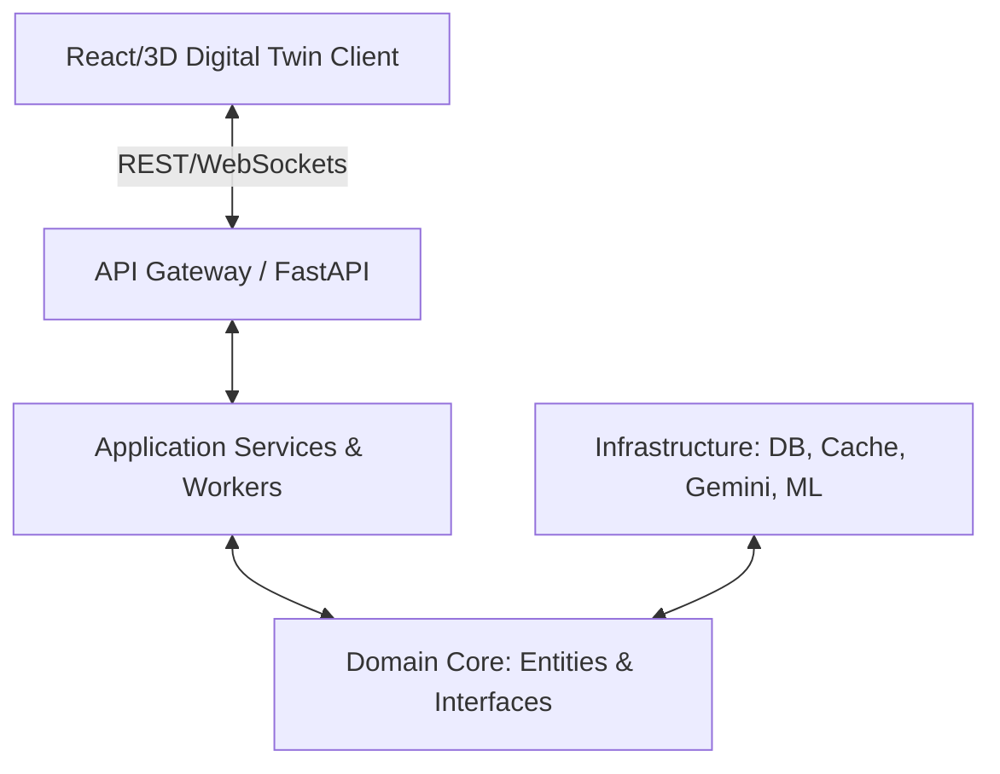
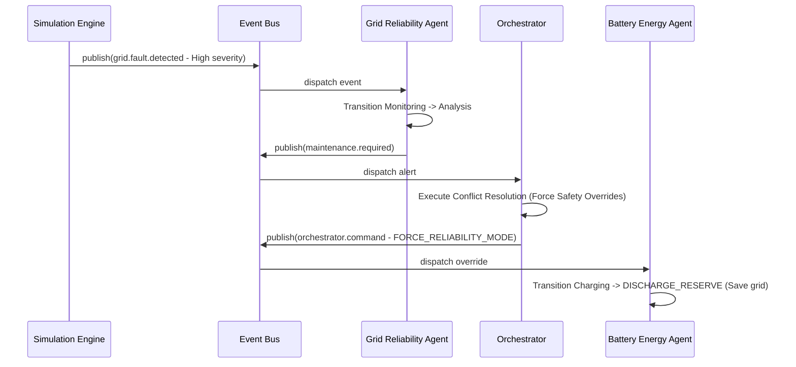
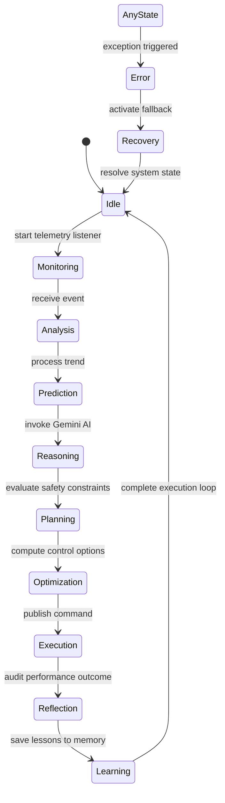

# FluxCore – Smart Grid Intelligence Platform System Architecture Documentation

This document describes the design, entities, events, lifecycles, and deployment topologies of the **FluxCore** platform.

---

## 1. System Architecture

FluxCore is built on a **Clean Architecture** model with complete decoupling of:
1. **Domain**: Abstract entities (Substations, Batteries, Forecasts, Alerts) and repository interfaces. Contains zero database dependencies.
2. **Application**: Workflows, Scheduler engines, notification routing, and background data simulation workers.
3. **Infrastructure**: Repositories mapped to database drivers, Redis cache layers, machine learning registries, vector similarity memory engines, and Google Gemini AI wrappers.
4. **Presentation (API Gateway)**: Asynchronous REST routes and WebSockets.



---

## 2. Shared Data Contracts & Event Bus

All communication is governed by typed, versioned Pydantic schemas. 

### Event Bus Topic Reference
- `telemetry.updated`: Live measurements published by physical sensors or simulators.
- `demand.forecast.updated`: Load forecasting updates published by Agent 1.
- `renewable.forecast.updated`: Generation forecasts published by Agent 2.
- `battery.strategy.selected`: Charging or discharging schedules published by Agent 3.
- `grid.fault.detected`: Network alert triggers published by Agent 4.
- `maintenance.required`: Wear warning alarms published by Agent 5.
- `economic.plan.updated`: Real-time trading prices published by Agent 6.
- `orchestrator.command`: Operational override controls published by the central Orchestrator.

### Sequence Flow: Incident Handling & Conflict Resolution


---

## 3. Agent Lifecycle State Machine

Every agent transitions through a deterministic state machine:



---

## 4. API Reference

### REST Endpoints
- `POST /api/v1/auth/token`: Issues JWT token.
  - *Query parameters*: `username`, `role` (Administrator, Grid Operator, Maintenance Engineer, Energy Analyst, Viewer).
- `GET /api/v1/health`: Checks system health.
- `POST /api/v1/config/reload`: Reloads configurations at runtime (Secured: Admin only).
- `GET /api/v1/metrics`: Serves performance variables (throughput, Event queue size, active sockets) (Secured: Operator/Analyst/Admin).
- `POST /api/v1/simulations/trigger`: Injects grid failures for testing (Secured: Operator/Admin).

### WebSockets Stream
- `WS /api/v1/ws?token=JWT_TOKEN`
- *Client actions*:
  - `{"action": "subscribe", "room": "telemetry"}`
  - `{"action": "subscribe", "room": "alerts"}`
  - `{"action": "subscribe", "room": "agent_states"}`

---

## 5. Deployment Guide

### Local Development (Docker Compose)
To launch all services (React UI, FastAPI Gateway, PostgreSQL, Redis) locally:
```bash
docker-compose up --build
```

### Kubernetes Ha Production
Deploy standard namespaces, replica configurations, and healthchecks:
```bash
kubectl apply -f k8s-deployment.yml
```

---

## 6. Developer Guide

### Setting up the Backend
1. Navigate to `/backend`.
2. Install dependencies:
   ```bash
   py -m pip install -r requirements.txt
   ```
3. Start the FastAPI server:
   ```bash
   py -m uvicorn main:app --reload
   ```

### Setting up the Frontend
1. Navigate to `/frontend`.
2. Start the Vite dev server:
   ```bash
   npm run dev
   ```
